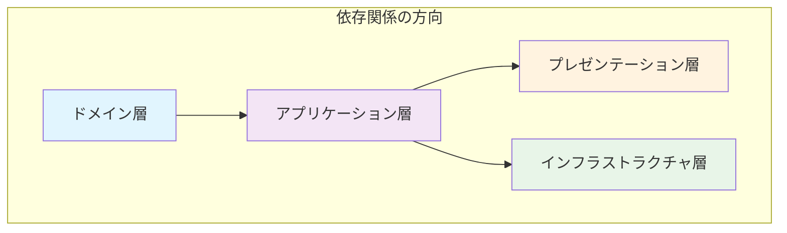
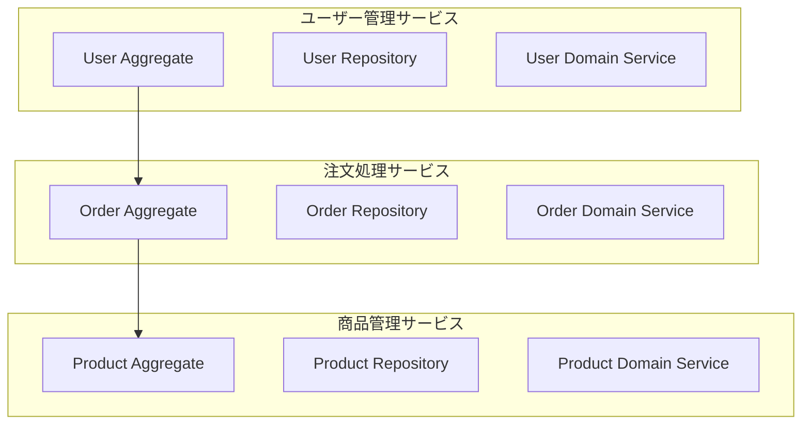

## 9. まとめと発展的なトピック

この開発ガイドでは、ドメイン駆動設計（DDD）の基本概念から、オニオンアーキテクチャに基づいたSpring BootとGoogle Cloud Spannerによる具体的な実装、そしてテスト戦略までを一通り解説しました。

### 9.1. 本ガイドのまとめ

#### 9.1.1. アーキテクチャの実現

*   **オニオンアーキテクチャ**: 中心にドメイン層を置き、依存性の方向を常に内側に向ける設計を採用しました。
*   **ドメイン層**: エンティティ、値オブジェクト、集約、リポジトリ、ドメインサービスといったDDDの基本的な構成要素を実装し、ビジネスの核心的なロジックとルールをこの層に閉じ込めました。
*   **アプリケーション層**: ドメイン層のオブジェクトを利用してユースケースを実現する、薄いコーディネーターとしての役割を担いました。
*   **インフラストラクチャ層**: Spring Data Spannerを用いたリポジトリの実装や、Spannerのスキーマ設計、RabbitMQとの連携など、外部の技術的な関心事を担当しました。
*   **プレゼンテーション層**: Spring MVCとSpring Securityを用いたREST APIの実装、DTOによるドメインモデルの隠蔽、統一されたエラーハンドリングを行いました。
*   **テスト**: Spockによるユニットテスト、インテグレーションテストに加え、ArchUnitによるアーキテクチャの静的検証の重要性を解説しました。

#### 9.1.2. 実現した設計原則

**1. 依存関係の制御**


**2. 関心の分離**
- ビジネスロジックはドメイン層に集約
- 技術的関心事はインフラストラクチャ層に分離
- ユースケースはアプリケーション層で調整

**3. テスタビリティ**
- 各層を独立してテスト可能
- モックとスタブを活用したテスト
- アーキテクチャの静的検証

#### 9.1.3. 得られたメリット

*   **保守性の向上**: 明確な責任分離と依存関係の制御により、変更の影響範囲を最小限に抑制
*   **拡張性の確保**: 新しい機能の追加が容易で、既存コードへの影響を最小限に抑制
*   **テスト容易性**: 各レイヤーを独立してテスト可能で、品質の向上を実現
*   **ビジネス価値の最大化**: ビジネスロジックの明確な表現により、ビジネス要件の理解と実装が容易

### 9.2. 実践的な次のステップ

#### 9.2.1. 段階的な導入戦略

**Phase 1: 既存システムの分析**
```java
// 現在のシステムの課題を特定
- ビジネスロジックの散在
- 技術的関心事とビジネスロジックの混在
- テストの困難さ
- 変更の影響範囲の大きさ
```

**Phase 2: ドメイン層の構築**
```java
// 最も重要なビジネスルールから開始
- エンティティと値オブジェクトの特定
- 集約境界の設計
- ドメインサービスの実装
```

**Phase 3: アプリケーション層の実装**
```java
// ユースケースの整理と実装
- アプリケーションサービスの作成
- コマンド・クエリオブジェクトの設計
- トランザクション境界の設定
```

**Phase 4: インフラストラクチャ層の整備**
```java
// 外部システムとの連携
- リポジトリの実装
- メッセージングの設定
- セキュリティの実装
```

**Phase 5: プレゼンテーション層の構築**
```java
// APIの設計と実装
- REST APIの設計
- DTOの実装
- エラーハンドリングの統一
```

#### 9.2.2. レガシーシステムの現代化

**1. 段階的リファクタリング**
```java
// 既存コードを段階的に改善
- ビジネスロジックの抽出
- 依存関係の整理
- テストの追加
```

**2. 新機能の分離**
```java
// 新機能は新しいアーキテクチャで実装
- マイクロサービスとして分離
- イベント駆動アーキテクチャの採用
- API Gatewayの活用
```

**3. データ移行戦略**
```java
// データベースの段階的移行
- 双方向同期の実装
- 段階的なデータ移行
- ロールバック戦略の準備
```

### 9.3. 発展的なトピック

#### 9.3.1. CQRS (Command Query Responsibility Segregation)

**CQRSとは**
システムの責務を、状態を変更する「コマンド」と、状態を取得する「クエリ」に明確に分離する設計パターンです。

**実装例:**
```java
// コマンド側（書き込み専用）
@Service
@Transactional
public class CreateOrderCommandService {
    public OrderId createOrder(CreateOrderCommand command) {
        // 正規化されたモデルで書き込み
        Order order = orderFactory.create(command);
        return orderRepository.save(order);
    }
}

// クエリ側（読み取り専用）
@Service
@Transactional(readOnly = true)
public class OrderQueryService {
    public OrderDto getOrder(OrderId orderId) {
        // 非正規化されたモデルで読み取り
        return orderQueryRepository.findById(orderId);
    }
}
```

**メリット:**
- 読み取りと書き込みの独立した最適化
- スケーラビリティの向上
- 複雑なクエリ要件への対応

#### 9.3.2. Event Sourcing

**Event Sourcingとは**
アプリケーションの状態を、状態そのものではなく、「状態を変更したイベントのシーケンス」として保存するアーキテクチャパターンです。

**実装例:**
```java
// イベントストア
public interface EventStore {
    void append(String aggregateId, List<DomainEvent> events, long expectedVersion);
    List<DomainEvent> getEvents(String aggregateId);
}

// イベントソーシング対応の集約
public class Order {
    private List<DomainEvent> uncommittedEvents = new ArrayList<>();
    
    public void addItem(Product product, int quantity) {
        // ビジネスルールの検証
        if (status != OrderStatus.DRAFT) {
            throw new IllegalStateException("Cannot modify confirmed order");
        }
        
        // イベントの発行
        OrderItemAddedEvent event = new OrderItemAddedEvent(
            id, product.getId(), quantity, product.getPrice()
        );
        uncommittedEvents.add(event);
        
        // 状態の更新
        items.add(new OrderItem(product, quantity));
    }
    
    public List<DomainEvent> getUncommittedEvents() {
        return new ArrayList<>(uncommittedEvents);
    }
    
    public void markEventsAsCommitted() {
        uncommittedEvents.clear();
    }
}
```

**メリット:**
- 完全な監査ログの自動生成
- 過去の任意の時点の状態復元
- デバッグの容易性

#### 9.3.3. マイクロサービスアーキテクチャ

**マイクロサービスとは**
巨大なモノリシックアプリケーションを、ビジネスの関心事（ドメイン）ごとに分割された、独立してデプロイ可能な小さなサービスの集合体として構築するアプローチです。

**境界づけられたコンテキストとの関係:**


**実装戦略:**
```java
// サービス間通信
@Service
public class OrderService {
    private final UserServiceClient userServiceClient;
    private final ProductServiceClient productServiceClient;
    
    public OrderDto createOrder(CreateOrderRequest request) {
        // 外部サービスの呼び出し
        UserDto user = userServiceClient.getUser(request.getUserId());
        ProductDto product = productServiceClient.getProduct(request.getProductId());
        
        // ローカルビジネスロジック
        Order order = orderFactory.create(user, product, request.getQuantity());
        return orderRepository.save(order);
    }
}
```

#### 9.3.4. Sagaパターン

**Sagaパターンとは**
マイクロサービスアーキテクチャなど、分散システムにおいて複数のサービスにまたがるトランザクション（分散トランザクション）を実現するための管理パターンです。

**コレオグラフィベースのSaga:**
```java
// 各サービスがイベントをリッスン
@Service
public class OrderService {
    
    @EventListener
    public void handlePaymentProcessedEvent(PaymentProcessedEvent event) {
        Order order = orderRepository.findById(event.getOrderId());
        order.confirm();
        orderRepository.save(order);
        
        // 次のイベントを発行
        eventPublisher.publish(new OrderConfirmedEvent(order.getId()));
    }
}

@Service
public class InventoryService {
    
    @EventListener
    public void handleOrderConfirmedEvent(OrderConfirmedEvent event) {
        // 在庫の確保
        inventoryRepository.reserve(event.getOrderId());
        
        // 次のイベントを発行
        eventPublisher.publish(new InventoryReservedEvent(event.getOrderId()));
    }
}
```

**オーケストレーションベースのSaga:**
```java
@Service
public class CreateOrderSaga {
    
    public void execute(CreateOrderCommand command) {
        try {
            // Step 1: 注文作成
            OrderDto order = orderService.createOrder(command);
            
            // Step 2: 在庫確保
            inventoryService.reserveInventory(order.getId(), command.getItems());
            
            // Step 3: 支払い処理
            paymentService.processPayment(order.getId(), command.getPaymentMethod());
            
            // Step 4: 注文確定
            orderService.confirmOrder(order.getId());
            
        } catch (Exception e) {
            // 補償トランザクションの実行
            compensate(e);
        }
    }
    
    private void compensate(Exception e) {
        // 各ステップの補償処理を実行
        paymentService.cancelPayment(orderId);
        inventoryService.releaseInventory(orderId);
        orderService.cancelOrder(orderId);
    }
}
```

#### 9.3.5. リアクティブプログラミング

**リアクティブプログラミングとは**
非同期でノンブロッキングな処理を実現し、高いスループットと低いレイテンシーを実現するプログラミングパラダイムです。

**Spring WebFluxでの実装:**
```java
@RestController
public class ReactiveUserController {
    
    private final ReactiveUserService userService;
    
    @GetMapping("/users")
    public Flux<UserDto> getUsers() {
        return userService.findAll()
            .map(userDtoMapper::toDto);
    }
    
    @PostMapping("/users")
    public Mono<UserDto> createUser(@RequestBody CreateUserRequest request) {
        return userService.createUser(request)
            .map(userDtoMapper::toDto);
    }
}

@Service
public class ReactiveUserService {
    
    private final ReactiveUserRepository userRepository;
    
    public Flux<User> findAll() {
        return userRepository.findAll();
    }
    
    public Mono<User> createUser(CreateUserRequest request) {
        User user = userFactory.create(request);
        return userRepository.save(user);
    }
}
```

#### 9.3.6. GraphQL

**GraphQLとは**
クライアントが必要なデータだけを指定して取得できるクエリ言語です。

**Spring GraphQLでの実装:**
```java
@Controller
public class UserController {
    
    @QueryMapping
    public UserDto user(@Argument String id) {
        return userService.getUser(new UserId(id));
    }
    
    @QueryMapping
    public List<UserDto> users() {
        return userService.getUsers();
    }
    
    @MutationMapping
    public UserDto createUser(@Argument CreateUserInput input) {
        return userService.createUser(input);
    }
}

// GraphQLスキーマ
type User {
    id: ID!
    fullName: String!
    email: String!
    status: UserStatus!
    createdAt: DateTime!
    updatedAt: DateTime!
}

type Query {
    user(id: ID!): User
    users: [User!]!
}

type Mutation {
    createUser(input: CreateUserInput!): User!
}
```

### 9.4. 継続的な学習と改善

#### 9.4.1. 学習リソース

**書籍:**
- "Domain-Driven Design" by Eric Evans
- "Implementing Domain-Driven Design" by Vaughn Vernon
- "Clean Architecture" by Robert C. Martin
- "Building Microservices" by Sam Newman

**オンラインリソース:**
- DDD Community: https://domainlanguage.com/
- Martin Fowler's Blog: https://martinfowler.com/
- Spring Framework Documentation: https://spring.io/
- Google Cloud Spanner Documentation: https://cloud.google.com/spanner

#### 9.4.2. 実践的な改善活動

**1. コードレビューの強化**
```java
// アーキテクチャ原則のチェックリスト
- 依存関係の方向が正しいか
- ビジネスロジックが適切な層に配置されているか
- テストが十分に書かれているか
- 命名がドメイン用語を反映しているか
```

**2. メトリクスの活用**
```java
// 監視すべきメトリクス
- アプリケーションの応答時間
- データベースのクエリパフォーマンス
- エラー率と例外の種類
- ビジネス指標（注文数、売上など）
```

**3. 継続的改善**
```java
// 定期的な振り返り
- アーキテクチャの有効性の評価
- パフォーマンスの改善
- セキュリティの強化
- 開発効率の向上
```

### 9.5. まとめ

このガイドで示したプラクティスに従うことで、複雑なビジネス要件にも対応可能で、保守性・拡張性の高いアプリケーションを構築するための強固な土台を築くことができます。

**重要なポイント:**
1. **ビジネス価値の重視**: 技術的な実装よりもビジネス要件の理解を優先
2. **継続的な学習**: DDDと関連技術の世界は奥深く、常に新しい知識を吸収
3. **実践的な適用**: 理論だけでなく、実際のプロジェクトで活用
4. **チーム全体の理解**: 開発チーム全体がDDDの原則を理解し、実践

これらの発展的なトピックは、それぞれが専門書一冊分になるほどの内容ですが、本ガイドで築いた基礎知識は、これらの高度な概念を理解するための良い出発点となるはずです。継続的な学習を通じて、より洗練されたソフトウェア設計を目指してください。

**最後に**
DDDとオニオンアーキテクチャは、単なる技術的なパターンではありません。これらは、ビジネス価値を最大化し、長期的に保守可能なシステムを構築するための哲学です。このガイドが、あなたのソフトウェア開発の旅の一助となることを願っています。 